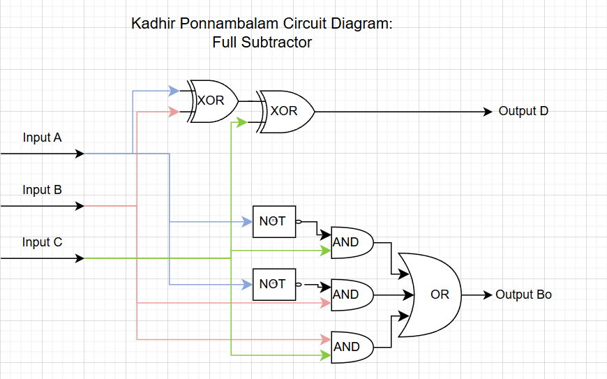
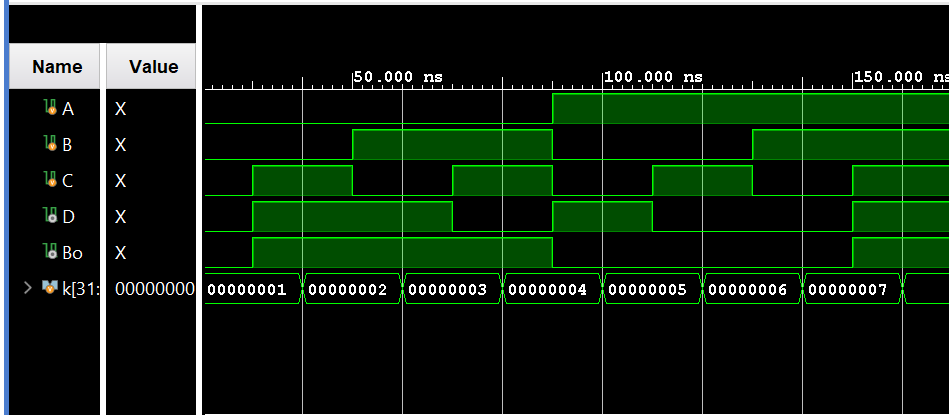

## Full Subtractor Using Logic Gates (Verilog)

A Verilog implementation of a **1‑bit full subtractor**, developed using the Vivado IDE. This document explains the underlying theory, presents the truth table, shows how Karnaugh maps (K‑maps) lead to minimized Boolean expressions, and summarizes the circuit, waveform, and simulation results.

---

## Table of Contents

- [What Is a Full Subtractor?](#what-is-a-full-subtractor)
- [Full Subtractor Theory](#full-subtractor-theory)
- [Learning Resources](#learning-resources)
- [Truth Table](#truth-table)
- [K-Maps and Boolean Derivations](#k-maps-and-boolean-derivations)
  - [Difference Output \(D\) K-Map](#difference-output-d-k-map)
  - [Borrow Output \(B<sub>o</sub>\) K-Map](#borrow-output-bo-k-map)
- [Full Subtractor Architecture](#full-subtractor-architecture)
- [Circuit Diagram](#circuit-diagram)
- [Waveform Diagram](#waveform-diagram)
- [Testbench Output](#testbench-output)
- [Running the Project in Vivado](#running-the-project-in-vivado)
- [Project Files](#project-files)

---

## What Is a Full Subtractor?

A **full subtractor** is a combinational circuit that **subtracts one single‑bit binary value and a borrow‑in from another single‑bit binary value**. It has three inputs and two outputs:

- **Inputs**
  - **A** – minuend bit (the bit from which we subtract).
  - **B** – subtrahend bit (the bit that is subtracted from A).
  - **C** – borrow‑in bit from the adjacent bit position (previous subtraction stage).
- **Outputs**
  - **D** – difference bit, representing the least significant bit of \(A - B - C\).
  - **B<sub>o</sub>** – borrow‑out bit, which becomes 1 when the subtraction would otherwise be negative (i.e., when \(A < B + C\)).

In binary subtraction, if we attempt to compute \(A - B - C\) and the result would be negative, a **borrow of 1** is taken from the next more significant bit, effectively adding 2 to A at this position and setting the borrow‑out \(B<sub>o</sub> = 1\). The full subtractor captures this behavior for a single bit position while also considering an incoming borrow.

---

## Full Subtractor Theory

The full subtractor implements:

\[
D = A - B - C
\]

with outputs:

- **Difference \(D\)**: the lower‑order bit of the subtraction result.
- **Borrow‑out \(B<sub>o</sub>\)**: indicates whether a borrow is needed from the next higher bit.

From the truth table (shown below), the minimized Boolean expressions for a full subtractor are:

- \[
  D = A \oplus B \oplus C
  \]
- \[
  B_o = \overline{A}B + \overline{A}C + BC
  \]

where:

- \(\overline{A}\) denotes NOT A.
- \(\oplus\) denotes the XOR (exclusive‑OR) operation.

In this project, the Verilog module `fullSubtractor` realizes these equations using basic logic gates or continuous assignments.

---

## Learning Resources

Useful online resources for full subtractors, binary subtraction with borrow, K‑maps, and digital design:

| Resource | Description |
|----------|-------------|
| [Full Subtractor (YouTube)](https://www.youtube.com/results?search_query=full+subtractor) | Concept, truth table, and typical gate‑level implementations. |
| [Binary Subtraction & Borrow (YouTube)](https://www.youtube.com/results?search_query=binary+subtraction+with+borrow) | Explains how borrowing works in multi‑bit binary subtraction. |
| [K-Map Simplification (YouTube)](https://www.youtube.com/results?search_query=karnaugh+map+simplification) | Karnaugh‑map based derivation of minimal Boolean expressions. |
| [Verilog Combinational Circuits (YouTube)](https://www.youtube.com/results?search_query=verilog+combinational+circuits) | RTL and testbench examples for basic logic circuits in Verilog. |

---

## Truth Table

The full subtractor has three inputs \(A, B, C\) and two outputs \(D, B<sub>o</sub>\). The truth table is:

| **A** | **B** | **C (borrow‑in)** | **D** | **B<sub>o</sub>** |
|:-----:|:-----:|:-----------------:|:-----:|:-----------------:|
| 0 | 0 | 0 | 0 | 0 |
| 0 | 0 | 1 | 1 | 1 |
| 0 | 1 | 0 | 1 | 1 |
| 0 | 1 | 1 | 0 | 1 |
| 1 | 0 | 0 | 1 | 0 |
| 1 | 0 | 1 | 0 | 0 |
| 1 | 1 | 0 | 0 | 0 |
| 1 | 1 | 1 | 1 | 1 |

This is the **final truth table** of the 1‑bit full subtractor. It reflects the rules of single‑bit binary subtraction with borrow:

- When the effective minuend is large enough (\(A \geq B + C\)), the borrow‑out \(B<sub>o</sub> = 0\).
- When the effective minuend is too small (\(A < B + C\)), the circuit borrows from the next higher bit and sets \(B<sub>o</sub> = 1\).

---

## K-Maps and Boolean Derivations

To derive minimal Boolean expressions, we use Karnaugh maps (K‑maps) with:

- Row variable: **A**
- Column variables: **B, C** (in Gray code order 00, 01, 11, 10)

### Difference Output \(D\) K-Map

**K‑map for \(D\):**

| **A \\ BC** | **00** | **01** | **11** | **10** |
|:-----------:|:------:|:------:|:------:|:------:|
| **0** | 0 | 1 | 0 | 1 |
| **1** | 1 | 0 | 1 | 0 |

From this map, the 1‑cells correspond to minterms:

\[
D = A\overline{B}\,\overline{C} + \overline{A}\,\overline{B}C + ABC + \overline{A}BC
\]

We can group and factor these minterms by introducing:

\[
X = B \oplus C
\]

so that:

\[
D = A\overline{X} + \overline{A}X
\]

This is the classic XOR pattern:

\[
D = A \oplus X = A \oplus B \oplus C
\]

Thus, the **difference output** of a full subtractor is simply the XOR of all three inputs.

### Borrow Output \(B<sub>o</sub>\) K-Map

**K‑map for \(B<sub>o</sub>\):**

| **A \\ BC** | **00** | **01** | **11** | **10** |
|:-----------:|:------:|:------:|:------:|:------:|
| **0** | 0 | 1 | 1 | 1 |
| **1** | 0 | 0 | 1 | 0 |

The 1‑cells can be grouped into three groups of two, yielding:

\[
B_o = \overline{A}C + \overline{A}B + BC
\]

These minimized equations for \(D\) and \(B_o\) are exactly what the `fullSubtractor` module implements.

---

## Full Subtractor Architecture

The full subtractor can be implemented using a small set of logic gates:

- **Difference \(D\)**: realized as a three‑input XOR, often implemented as:
  - First stage: \(X = A \oplus B\)
  - Second stage: \(D = X \oplus C\)
- **Borrow‑out \(B<sub>o</sub>\)**: realized as a sum‑of‑products (SOP) network:
  - Term 1: \(\overline{A}B\)
  - Term 2: \(\overline{A}C\)
  - Term 3: \(BC\)
  - Final OR: \(B_o = \overline{A}B + \overline{A}C + BC\)

Conceptually:

1. Invert A to produce \(\overline{A}\).
2. Use AND gates to generate the product terms \(\overline{A}B\), \(\overline{A}C\), and \(BC\).
3. OR these terms to produce the borrow‑out \(B<sub>o</sub>\).
4. Cascade XOR gates to produce the difference \(D\).

In Verilog, this can be written using **continuous assignments** (e.g., `assign`) or explicit gate instantiations. A typical port mapping is:

- Inputs: `A`, `B`, `C`
- Outputs: `D`, `Bo` (used in code to represent \(B<sub>o</sub>\))

---

## Circuit Diagram

This section corresponds to the **logic diagram** of the full subtractor, showing:

- XOR gates that together realize \(D = A \oplus B \oplus C\).
- Inverters and AND/OR gates realizing \(B_o = \overline{A}B + \overline{A}C + BC\).



---

## Waveform Diagram

The behavioral simulation waveform shows inputs A, B, and C cycling through all eight possible combinations, while outputs D and \(B<sub>o</sub>\) follow the expected subtraction results from the truth table.



---

## Testbench Output

The testbench applies each combination of A, B, and C and prints the resulting difference and borrow‑out. A representative simulation log is:

```text
A = 0, B = 0, C = 0, D = 0, Bo = 0 
A = 0, B = 0, C = 1, D = 1, Bo = 1 
A = 0, B = 1, C = 0, D = 1, Bo = 1 
A = 0, B = 1, C = 1, D = 0, Bo = 1 
A = 1, B = 0, C = 0, D = 1, Bo = 0 
A = 1, B = 0, C = 1, D = 0, Bo = 0 
A = 1, B = 1, C = 0, D = 0, Bo = 0 
A = 1, B = 1, C = 1, D = 1, Bo = 1
```

These results match the theoretical full subtractor truth table exactly, confirming that the **full subtractor implementation is functionally correct**.

---

## Running the Project in Vivado

Follow these steps to open the project in **Vivado** and run the simulation.

### Prerequisites

- **Xilinx Vivado** installed (Vivado HL Design Edition, Lab Edition, or any recent version compatible with your OS).

### 1. Launch Vivado

1. Start Vivado from the Start Menu (Windows) or your application launcher.
2. Choose **Vivado** (or **Vivado HLx**).

### 2. Create a New RTL Project

1. Click **Create Project** (or **File → Project → New**).
2. Click **Next** on the welcome page.
3. Choose **RTL Project** and leave **Do not specify sources at this time** unchecked if you plan to add sources immediately.
4. Click **Next**.

### 3. Add Design and Simulation Sources

1. In the **Add Sources** step, add the Verilog design files:
   - **Design sources:**
     - `fullSubtractor.v` – 1‑bit full subtractor module.
   - **Simulation sources:**
     - `fullSubtractor_tb.v` – testbench applying all input combinations and printing/observing the outputs.
2. Ensure the testbench is set as the **top module for simulation**:
   - In the **Sources** window, under **Simulation Sources**, right‑click `fullSubtractor_tb.v` → **Set as Top**.
3. Click **Next**, choose a suitable **target device** (or leave default/“Don’t specify” for simulation‑only usage), then **Next → Finish**.

### 4. Run Behavioral Simulation

1. In the **Flow Navigator** (left panel), under **Simulation**, click **Run Behavioral Simulation**.
2. Vivado will:
   - Elaborate the design hierarchy (`fullSubtractor` as the DUT).
   - Compile the design and testbench.
   - Open the **Simulation** view with the waveform.
3. Inspect the waveform:
   - Confirm that A, B, and C cycle through all eight combinations: 000, 001, 010, 011, 100, 101, 110, 111.
   - Verify that D and \(B<sub>o</sub>\) match the full subtractor truth table.

### 5. (Optional) Re-run or Modify the Design

- To re-run the simulation, use **Flow Navigator → Simulation → Run Behavioral Simulation** or the re‑run icon in the simulation toolbar.
- To change the design or testbench:
  - Edit `fullSubtractor.v` or `fullSubtractor_tb.v`.
  - Save the files.
  - Re-run the behavioral simulation.

### 6. (Optional) Synthesis, Implementation, and Bitstream

If you want to map the design to a physical FPGA:

1. In **Sources**, right‑click the top-level RTL module (e.g., `fullSubtractor.v`) → **Set as Top** (for synthesis/implementation).
2. Run **Synthesis** from the Flow Navigator.
3. Run **Implementation**.
4. Create or edit a constraints file (e.g. `.xdc`) to assign pins for A, B, C, D, and \(B<sub>o</sub>\).
5. Run **Generate Bitstream** to produce the configuration file for your FPGA board.

---

## Project Files

- `fullSubtractor.v` — RTL for the 1‑bit full subtractor \((A, B, C) \rightarrow (D, B<sub>o</sub>)\).
- `fullSubtractor_tb.v` — testbench for the full subtractor; applies all input combinations and prints/observes the outputs.

---

*Author: **Kadhir Ponnambalam*** 

# Full-Subtractor
Implemented a full subtractor. More details on the process in the README.
